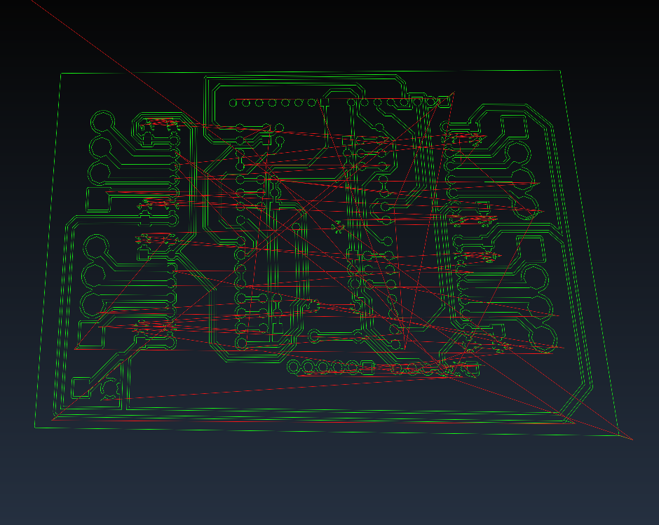

gbl2ngc
=======

Open source no frills Gerber to gcode converter, using (a slightly modified) [Clipper Lib](http://www.angusj.com/delphi/clipper.php).  Produces an isolation routing gcode file for the given Gerber file.

gbl2ngc will convert a Gerber file like this:


to a gcode file like this:





to compile:
-----------

    cd src
    ./cmp.sh

example usage:
--------------

    gbl2ngc --input example/example.gbl --radius 0.0025 --output example.ngc

Current version is in an alpha state, so use at your own risk.

command line options
---

```
$ ./gbl2ngc -h

gbl2ngc: A gerber to gcode converter
Version 0.7.0
  -r, --radius radius                 radius (default 0)
  -F, --fillradius fillradius         radius to be used for fill pattern (default to radius above)
  -i, --input input                   input file
  -o, --output output                 output file (default stdout)
  -f, --feed feed                     feed rate (default 10)
  -s, --seek seek                     seek rate (default 100)
  -z, --zsafe zsafe                   z safe height (default 0.1 inches)
  -Z, --zcut zcut                     z cut height (default -0.05 inches)
  -M, --metric                        units in metric
  -I, --inches                        units in inches (default)
  -C, --no-comment                    do not show comments
  -R, --machine-readable              machine readable (uppercase, no spaces in gcode)
  -H, --horizontal                    route out blank areas with a horizontal scan line technique
  -V, --vertical                      route out blank areas with a vertical scan line technique
  -G, --zengarden                     route out blank areas with a 'zen garden' technique
  -P, --print-polygon                 print polygon regions only (for debugging)
  --invertfill                        invert the fill pattern (experimental)
  --simple-infill                     infill copper polygons with pattern (currently only -H and -V supported)
  --no-outline                        do not route out outline when doing infill
  -v, --verbose                       verbose
  -N, --version                       display version information
  -h, --help                          help (this screen)
```

See the [documentation](doc/Documentation.md) for a more detailed description of each of the options.

License:
-----

GPLv3


